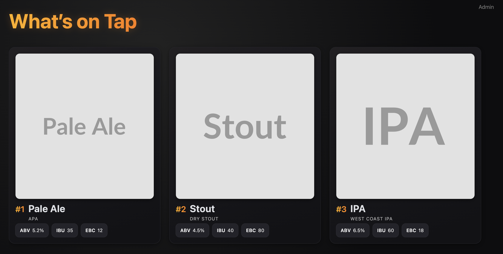

# OpenTapWall


Single-container FastAPI app to display and administer a tap list (beers) with images. Designed to run on single-board computers or any small host. Single Docker image using SQLite + a mounted volume for persistence. On first start the container creates a sample database automatically (three example beers + default settings) if the DB file does not yet exist.
Currently only supports beer, other drinks are planned.

## Features
- FastAPI + SQLModel (SQLite file DB)
- Auto-creates DB and seeds sample beers if empty (one‑shot initialization handled by entrypoint)
- Admin UI at `/admin` for:
	- Creating beers
	- Inline edit tap number / name / style
	- Upload images (stored in DB as BLOBs)
	- Delete beers
- Public display wall at `/` optimized for fullscreen TV (dark theme, responsive)
- Display title and logo (upload a logo) stored in DB
- Lightweight runtime migration adds new nullable columns and tables if missing

## Quick Start (local build)
Build the image:
```
docker build -t opentapwall:latest .
```

Run the container with persistence:
```
mkdir -p opentapwall_data
docker run -d \
	--name opentapwall \
	-p 8000:8000 \
	-v $(pwd)/opentapwall_data:/data \
	opentapwall:latest
```

Open:
- Wall: http://localhost:8000/
- Admin: http://localhost:8000/admin

### Development (Hot Reload)
Bind mount the source and override the command:
```
docker run --rm -it \
	-p 8000:8000 \
	-v $(pwd):/code \
	-v $(pwd)/opentapwall_data:/data \
	-e DB_PATH=/data/opentapwall.db \
	opentapwall:latest \
	uvicorn app.main:app --host 0.0.0.0 --port 8000 --reload
```

### Environment Variables
| Variable | Purpose | Default |
|----------|---------|---------|
| `DB_PATH` | SQLite database file path | `/data/opentapwall.db` |

### Data Persistence
All persistent state lives under `/data` (mapped to your host `opentapwall_data` directory). This includes the SQLite database which stores beers, settings, and image BLOBs. Back it up by copying that folder. If you remove the `opentapwall.db` file, a fresh sample will be generated on the next container start.

## API Summary
- `GET /beers/` list beers
- `POST /beers/` create via JSON
- `POST /beers/create` form-create (used by Admin UI)
- `PATCH /beers/{id}` partial update
- `DELETE /beers/{id}` delete
- `POST /beers/upload-image/{id}` attach image file (multipart)
- `PATCH /settings` update display title
- `POST /settings/logo` upload logo image
- `GET /images/{id}` serve stored image by id

## Lightweight Migration
On startup a simple check ensures new nullable columns / tables are added if missing (beer image columns, display settings, stored image table).

## Entrypoint Initialization
The Docker image uses an entrypoint script (`docker-entrypoint.sh`) which:
1. Ensures the `/data` directory exists.
2. If the database file defined by `DB_PATH` does not exist, creates tables and seeds three sample beers plus default display settings.
3. Starts the `uvicorn` server.

To force re-seeding, delete the database file inside your mounted volume:
```
rm opentapwall_data/opentapwall.db
```
Then restart the container.

### CI/CD
This repo contains a workflow at `.github/workflows/docker-publish.yml` that builds and pushes multi-arch images on pushes to `main` and on version tags (`vX.Y.Z`).

## Support me
If you might find this app useful, support me on [Ko-fi](https://ko-fi.com/olivercorrodi)!