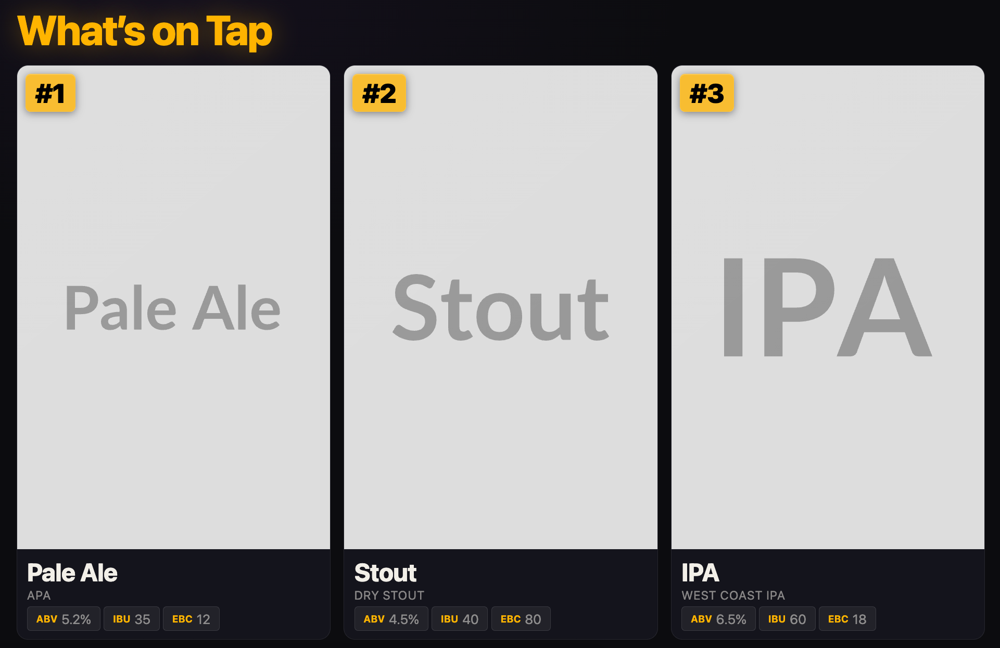

# OpenTapWall


A tap list display wall for your bar, taproom, or homebrew setup. Point a TV at it and your customers always know what's on tap. Manage everything from a simple admin page — no technical knowledge needed after setup.

## How it works

OpenTapWall is a small server that runs on a machine in your bar. Any browser on your network can then open the wall or the admin page. There are three common setups:

| Setup | Server | Display |
|-------|--------|---------|
| **All-in-one** | A PC/laptop connected to the TV via HDMI | Browser on the same machine, fullscreened on the TV |
| **Smart TV** | Any machine on your network (e.g. a Raspberry Pi tucked away) | Smart TV browser pointed at the server's IP |
| **Dedicated display device** | Raspberry Pi or any machine on your network | A separate small device (tablet, Chromecast, Fire Stick) with a browser on the TV |

All setups use the same installation. The **server** is where you install Docker and run the command below. The **display** just needs a browser.

> ⚠️ **No login protection (yet).** Anyone on the same network can access the admin page and change your beers. If your bar's guest Wi-Fi and your server are on the same network, keep this in mind. The safest setup is to run OpenTapWall on a separate staff-only network, or on a machine that's only reachable from your local wired network. The **all-in-one setup** sidesteps this entirely — once the image is pulled, it runs fully offline with no network required.

## What you need

**A machine to run the server on.** Any of these work:
- A **Raspberry Pi 3 or newer** — recommended (cheap, silent, runs 24/7)
- Any old laptop or PC with Linux, macOS, or Windows

---

## Installation

### Step 1 — Install Docker on the server machine

Docker is the tool that runs OpenTapWall. Install it for your system:

- **Raspberry Pi / Linux:** Open a terminal and run:
  ```bash
  curl -fsSL https://get.docker.com | sh
  ```
- **Mac:** Download [Docker Desktop](https://docs.docker.com/desktop/install/mac-install/)
- **Windows:** Download [Docker Desktop](https://docs.docker.com/desktop/install/windows-install/)

> **How to open a terminal on Linux/Raspberry Pi:** Press `Ctrl + Alt + T`, or find "Terminal" in your applications menu. On a headless Raspberry Pi, connect via SSH.

### Step 2 — Run OpenTapWall

In the terminal on your server machine, paste this and press Enter:

```bash
docker run -d \
  --name opentapwall \
  --restart unless-stopped \
  -p 8000:8000 \
  -v opentapwall_data:/data \
  corrooli/opentapwall:latest
```

Docker downloads the app automatically (first run takes a minute or two). Once done, it runs in the background and restarts automatically on reboot.

### Step 3 — Open it

> **Find your server's IP address:** run `hostname -I` in the terminal. Use the first number shown.

| What | URL |
|------|-----|
| **Wall** — open this on the display/TV | `http://<server-ip>:8000` |
| **Admin** — open this on your phone or laptop | `http://<server-ip>:8000/admin` |

Example: if your server IP is `192.168.1.50`, the wall is at `http://192.168.1.50:8000`.

If the server and display are the **same machine**, you can use `http://localhost:8000` instead.

Three sample beers are added on first start. Open **Admin** to replace them with your own.

---

## Features

### Wall (`/`)
- Three layout modes: **Grid** (smart column count), **Carousel** (animated horizontal scroll), **Vertical** (portrait cards side by side)
- Tap number badge and optional price badge on each beer image
- ABV / IBU / EBC stat badges
- Dark and light themes with a custom accent color
- Optional logo and background image (with glassmorphism effect)
- Header can be hidden for a cleaner full-screen look
- Auto-refreshes when you change something in Admin — no manual reload needed

### Admin (`/admin`)
- Add, edit, and delete beers; upload images; show or hide per tap
- Change title, accent color, theme, layout, currency, logo, background
- 63 supported currencies

---

## Updating

When a new version is released, run these three commands:

```bash
docker pull corrooli/opentapwall:latest
docker stop opentapwall && docker rm opentapwall
docker run -d --name opentapwall --restart unless-stopped -p 8000:8000 -v opentapwall_data:/data corrooli/opentapwall:latest
```

Your beers and settings are kept — only the app itself is updated.

## Stopping

```bash
docker stop opentapwall
```

## Uninstalling

```bash
docker stop opentapwall && docker rm opentapwall
docker rmi corrooli/opentapwall:latest
```

To also delete all your beer data:
```bash
docker volume rm opentapwall_data
```

---

## For developers

<details>
<summary>Building from source / modifying the app</summary>

```bash
git clone https://github.com/corrooli/OpenTapWall.git
cd OpenTapWall
docker build -t opentapwall:latest .
docker run -d \
  --name opentapwall \
  --restart unless-stopped \
  -p 8000:8000 \
  -v opentapwall_data:/data \
  opentapwall:latest
```

Hot reload during development:

```bash
docker run --rm -it \
  -p 8000:8000 \
  -v $(pwd):/code \
  -v opentapwall_data:/data \
  opentapwall:latest \
  uvicorn app.main:app --host 0.0.0.0 --port 8000 --reload
```

Without Docker:

```bash
pip install -r requirements.txt
DB_PATH=./data/opentapwall.db uvicorn app.main:app --reload
```

CI publishes multi-arch images (`linux/amd64` + `linux/arm64`) to Docker Hub on push to `main` and version tags.

</details>

---

## Support me
If you find this app useful, support me on [Ko-fi](https://ko-fi.com/olivercorrodi)!
